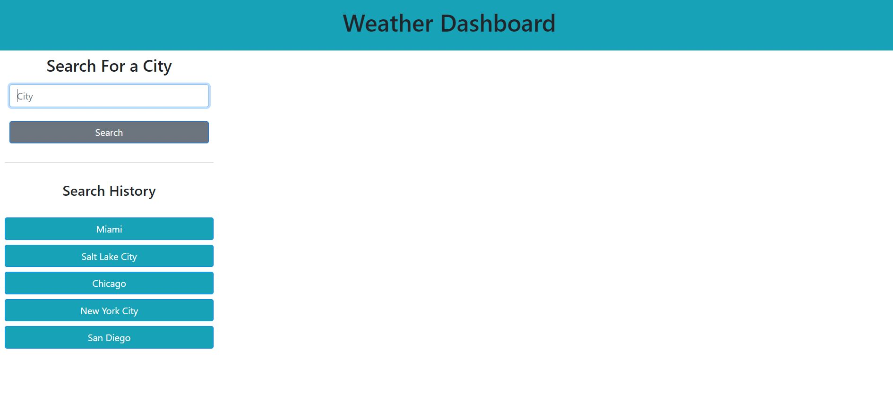
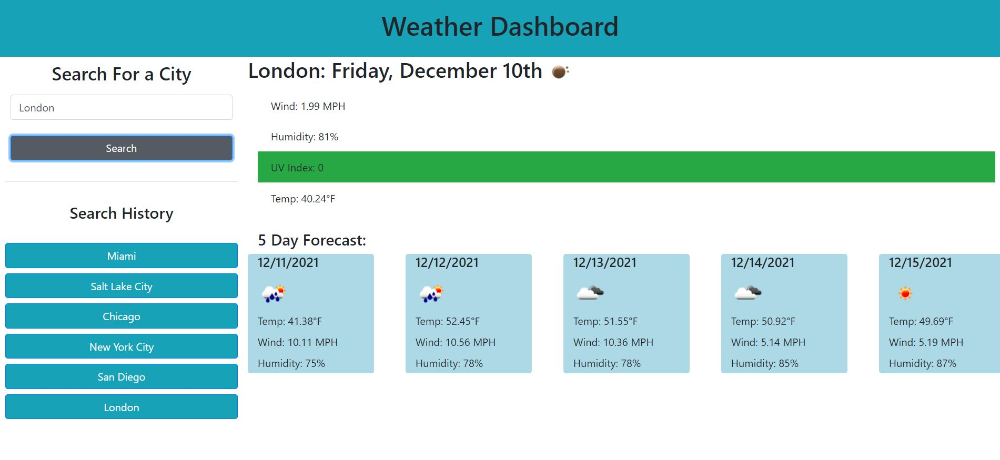

# weather-dashboard
Link to deployed site: https://mhowitz.github.io/weather-dashboard/ 

## Description

This project was created to gain more experience using server-side API's. I used OpenWeather to get coordinates when a user enters a location and then used those coordinates to get the weather data and append it to the screen. In this project, I used JavaScript, OpenWeather, HTML, CSS, Bootstrap, and LocalStorage. When the user searches a city, that city is added to a list of buttons below the search bar so the user may click on those buttons and revisit that city's weather data. This was done using local storage.

## Installation

Click the github URL link to view the website. To view the code, click the link to the github repository. Download the repository to your computer and unzip the file. Open the index.html file to view the HTML code. Open the style.css file to view the style sheet. Open the script.js file to view the JavaScript code.

## Usage

When the link is deployed, this is a screenshot of what the application looks like:

The user can enter in any city and the application will return the current weather data as well as a 5 day forecast, as shown in this screenshot:

## Credits

Andrew Tirpok-Tutor

## License

MIT License

Copyright (c) 2021 Mikayla Howitz

Permission is hereby granted, free of charge, to any person obtaining a copy of this software and associated documentation files (the "Software"), to deal in the Software without restriction, including without limitation the rights to use, copy, modify, merge, publish, distribute, sublicense, and/or sell copies of the Software, and to permit persons to whom the Software is furnished to do so, subject to the following conditions:

The above copyright notice and this permission notice shall be included in all copies or substantial portions of the Software.

THE SOFTWARE IS PROVIDED "AS IS", WITHOUT WARRANTY OF ANY KIND, EXPRESS OR IMPLIED, INCLUDING BUT NOT LIMITED TO THE WARRANTIES OF MERCHANTABILITY, FITNESS FOR A PARTICULAR PURPOSE AND NONINFRINGEMENT. IN NO EVENT SHALL THE AUTHORS OR COPYRIGHT HOLDERS BE LIABLE FOR ANY CLAIM, DAMAGES OR OTHER LIABILITY, WHETHER IN AN ACTION OF CONTRACT, TORT OR OTHERWISE, ARISING FROM, OUT OF OR IN CONNECTION WITH THE SOFTWARE OR THE USE OR OTHER DEALINGS IN THE SOFTWARE.
